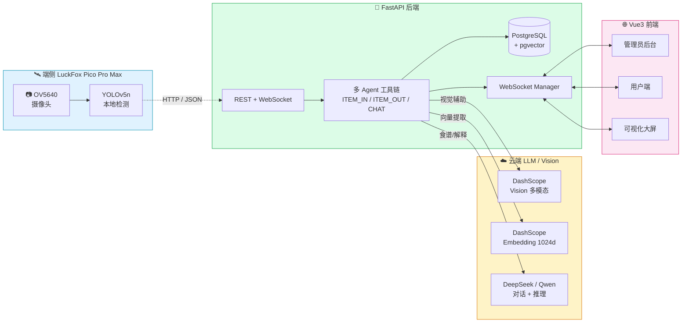

# 智能冰箱食材管理系统

> 一个端云协同的 AI 智能冰箱方案：LuckFox Pico Pro Max 端侧 YOLO + FastAPI 后端 + Vue3 前端 + 多 Agent 工具链。

[](https://www.python.org/)
[](https://fastapi.tiangolo.com/)
[](https://vuejs.org/)
[](https://www.postgresql.org/)
[](https://github.com/pgvector/pgvector)

## ✨ 核心亮点

| | |
|---|---|
| 🤖 **多 Agent 工具链** | ITEM_IN / ITEM_OUT / CHAT 三类 Agent，每一步全程 trace 留痕 |
| 🧠 **可解释 AI** | 一键让 LLM 把完整工具链翻译成自然语言决策报告 |
| 🌌 **神经管线可视化** | Canvas 2D 绘制的工具链图谱：极光背景 + 数据流光点 + 入场动画 |
| 🔁 **端云分工** | 端侧 YOLOv5n 出粗结果 + 共享置信度区间 + 云端 vision 复核 |
| 🏷️ **标签缓冲** | 端侧先扫包装标签 → 云端 OCR → 缓冲 → 物品入库时自动配对 |
| 🎯 **双层去重** | 字节 hash O(1) 拦截 + pgvector 向量相似度全表比对 |
| 🌊 **WebSocket 实时同步** | 库存 / 通知 / 大屏跨 tab 实时刷新，新行有滑入动画 |
| 📊 **Sankey 全链路可视化** | 来源 → 品类 → 终态，把一年的食材流向画清楚 |
| 💸 **浪费金额估算** | 按品类单价折算，年度日历热图 + 智能购物清单 |
| 🥗 **AI 营养教练** | 健康评分 + 临期食材 + 偏好 → 本周饮食安排 |
| 🛒 **购物清单 + 库存问答** | 自动补货建议 + 自然语言问"冰箱里还有什么" |
| 🏆 **成就系统** | 16 枚徽章 + Lv1-5 等级 + 烹饪日历打卡热图 |
| 🍳 **全屏烹饪模式** | 分步引导 + 倒计时 + 浏览器 TTS 朗读 |
| 🎙️ **语音输入** | 浏览器原生 Web Speech API，不耗 token |

## 🏗️ 系统架构



详细架构说明 → [docs/architecture.md](./docs/architecture.md)

## 📦 项目结构

```
luckfox_web/
├── client/                 # 后端（FastAPI）
│   ├── agents/             # 多 Agent 工具链
│   ├── api/                # REST + WebSocket 路由
│   ├── crud/               # 数据访问层
│   ├── models/             # SQLAlchemy ORM
│   ├── schemas/            # Pydantic 校验
│   ├── services/           # 视觉/LLM/向量/标签解析等
│   ├── demo/               # LuckFox 端侧模拟器
│   └── main.py
├── web/                    # 前端（Vue 3 + Vite + Element Plus）
│   ├── src/
│   │   ├── views/          # 页面（admin + user）
│   │   ├── components/     # 通用组件
│   │   ├── composables/    # WS / 主题 / 语音 / 撤销等 hook
│   │   ├── api/            # axios 封装
│   │   └── stores/         # Pinia
│   └── ...
├── database/               # SQL 迁移脚本
└── docs/                   # 项目文档（架构 / 演示脚本 / 论文素材）
```

## 🚀 快速启动

### 0. 一键启动（Windows，推荐演示用）

```
双击 start-demo.bat   # 自动拉起 后端 + 前端 + 端侧模拟器，并打开浏览器
双击 stop-demo.bat    # 一键停止全部
```

### 1. 准备环境

- Python 3.9+
- Node.js 18+
- PostgreSQL 15+ 并启用 `vector` / `uuid-ossp` 扩展

### 2. 后端

```bash
cd client
pip install -r requirements.txt
# 配置 .env：DATABASE_URL / LLM_API_KEY / VISION_API_KEY / ...
# 生产环境还必须配置：
# APP_ENV=production
# ADMIN_JWT_SECRET=<32字节以上随机密钥>
# USER_JWT_SECRET=<32字节以上随机密钥>
# CORS_ORIGINS=https://your-web-domain.com
# ADMIN_INITIAL_PASSWORD=<首次初始化管理员强密码>
python -m uvicorn main:app --port 8000 --reload
```

第一次启动会自动建表。开发环境如果未设置 `ADMIN_INITIAL_PASSWORD`，会兼容 seed 演示管理员 `admin / admin123`；生产环境不会使用默认密码，必须通过 `.env` 显式提供 `ADMIN_INITIAL_PASSWORD`。

### 3. 前端

```bash
cd web
npm install
npm run dev
# 默认 http://localhost:3000
```

### 4. 端侧模拟器（可选，演示用）

```bash
cd client/demo
python luckfox_simulator.py demo                    # 一次完整演示
python luckfox_simulator.py loop --interval 30     # 持续模式：每 30s 心跳 + 概率随机入库/出库
```

## 🎯 开发演示账号

| 角色 | 用户名 | 密码 |
|---|---|---|
| 管理员 | `admin` | `admin123`（仅开发环境默认） |
| 普通用户 | `xiaoyu` | `test123` |

> 生产环境不要使用演示账号。将 `APP_ENV` 设为 `production` 后，默认 JWT 密钥、空 CORS 白名单、空管理员初始化密码都会触发启动校验。

## 🌟 关键特性详解

### 多 Agent 工具链 + 全链路 Trace

每条事件触发的所有工具调用都按步骤写入 `agent_traces` 表，包含 `tool_name / tool_input / tool_output / status / duration_ms`。前端 `/admin/workflow` 用 SVG + 拖拽节点展示工具链拓扑，每一步都能展开看输入输出 JSON。

**可解释 AI**：右上角"AI 解释决策"按钮 → 让 LLM 把整条 trace 翻译成 200-300 字自然语言段落。

### 共享视觉辅助识别区间

端侧 YOLO 给的置信度落入 `[lower, upper]` 区间时才触发云端 vision 复核。手动入库 / 端侧 ITEM_IN 共用同一区间，由 admin 在 `/admin/agent` 页面用双滑块调整，所有变更写审计日志。

### 标签缓冲（端云分工的精髓）

端侧摄像头分辨率有限，识别食物没问题但读不清包装文字。设计：
1. 用户先把标签朝外让端侧拍 → POST `/events/label_scan` → 后端调云端 OCR + 结构化
2. 写入 `pending_labels` 缓冲表（5 分钟 TTL）
3. 用户把物品放进冰箱 → 端侧 YOLO 检测到物品 → POST `/events/item ITEM_IN`
4. 后端按时间窗自动配对最近一条未消费标签，把标签信息挂到 `inventory.label_data`

### 双层去重

```
新图入库
   ├─ 1) 字节 SHA256 hash → 命中？ 立刻 409 拒绝（O(1)）
   └─ 2) DashScope embedding (1024d) → pgvector 全表 cosine 相似度
              超过阈值 → 409 + 显示相似度 + 已有品类
```

新图入库 / 端侧 ITEM_IN / 整柜批量入库 全部走同一个 `services/dedup.py::check_duplicate`。

### WebSocket 实时同步

`broadcast_all` 把库存事件推给所有在线连接，前端：
- 列表新行有 0.45s 滑入 + 2.2s 薄荷绿高亮动画
- FridgeMap 新 bbox 弹出 + 脉冲圈
- 大屏右侧实时事件流自动滚动

## 📚 文档

| 文档 | 说明 |
|---|---|
| [docs/architecture.md](./docs/architecture.md) | 详细架构、模块划分、数据流 |
| [docs/features.md](./docs/features.md) | 全部功能清单（按模块分类） |
| [docs/device-protocol.md](./docs/device-protocol.md) | 端侧上报数据协议（4 接口完整 JSON） |
| [docs/highlights.md](./docs/highlights.md) | 创新点详解（论文素材库） |
| [docs/demo-script.md](./docs/demo-script.md) | 演示脚本（录视频/答辩） |
| [docs/changelog.md](./docs/changelog.md) | 开发历程（按版本倒序） |

## 🛠️ 技术栈

**后端**：FastAPI · SQLAlchemy 2.0 · PostgreSQL · pgvector · WebSocket · httpx · pydantic v2

**前端**：Vue 3 + `<script setup>` · Vite 6 · Element Plus · Pinia · Vue Router · ECharts · TypeScript

**AI / 视觉**：DashScope（多模态嵌入 + Vision 识别）· DeepSeek / Qwen Chat · OCR

**端侧**：LuckFox Pico Pro Max · OV5640 · YOLOv5n（RKNN）

## 📄 License

教学项目，仅作答辩 / 学习 / 个人使用。
