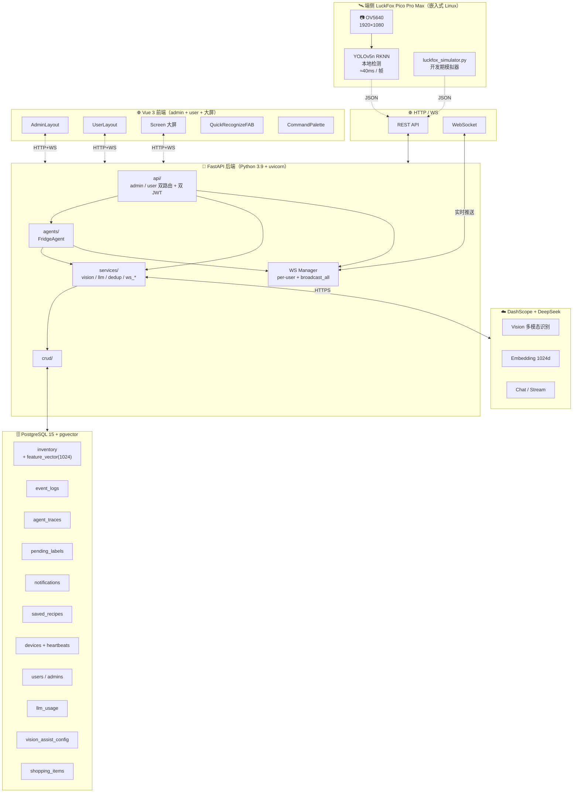
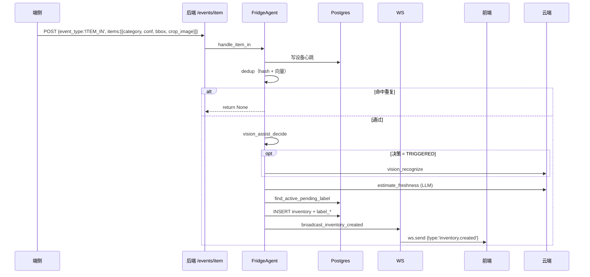
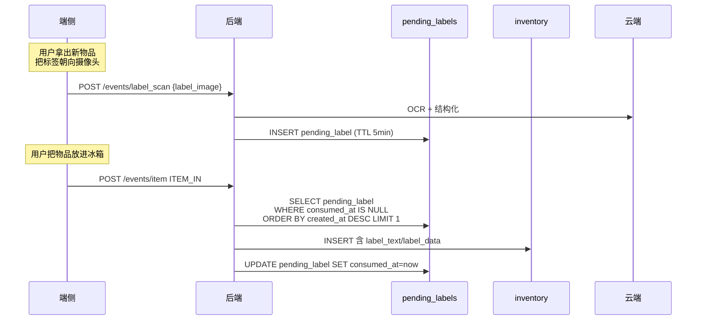
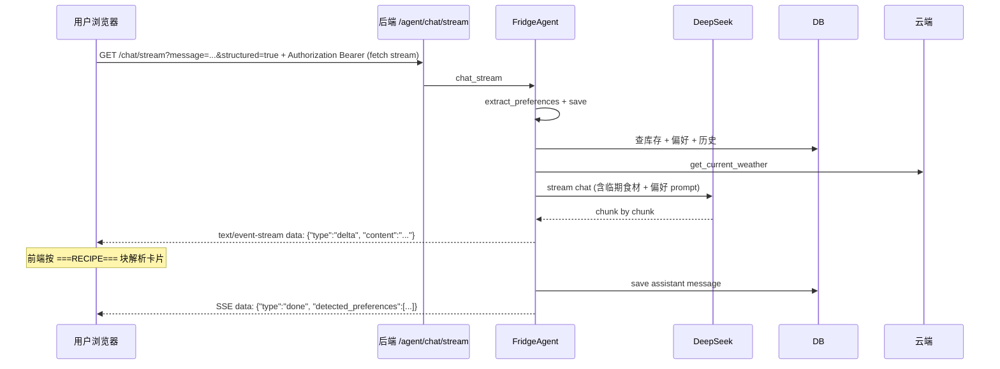
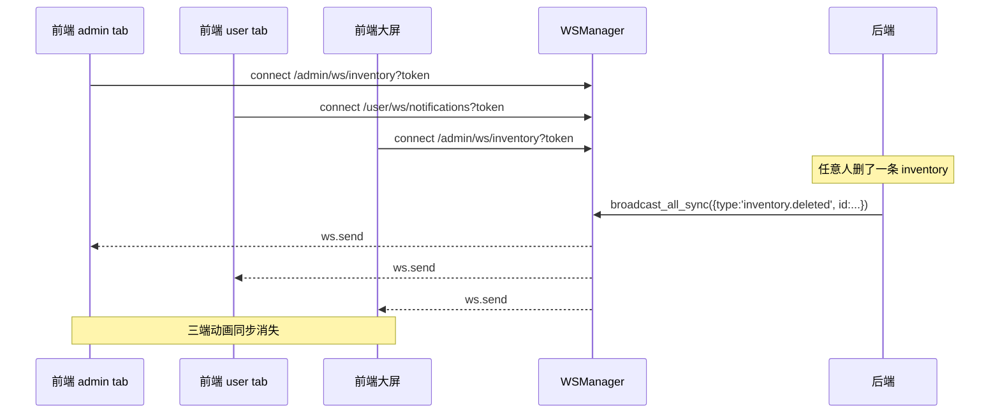
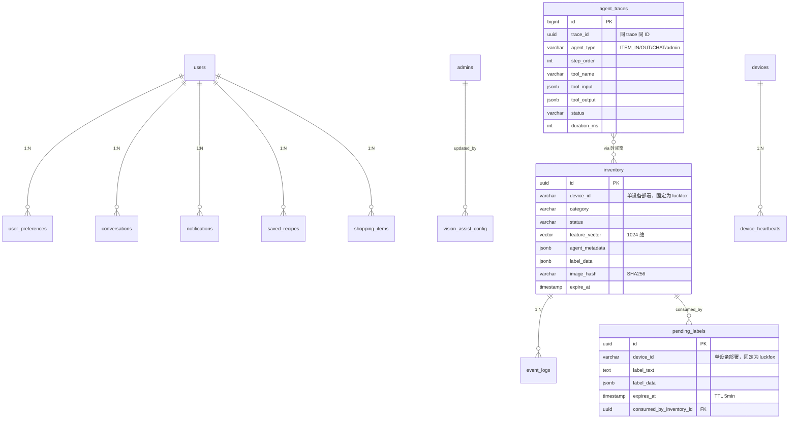
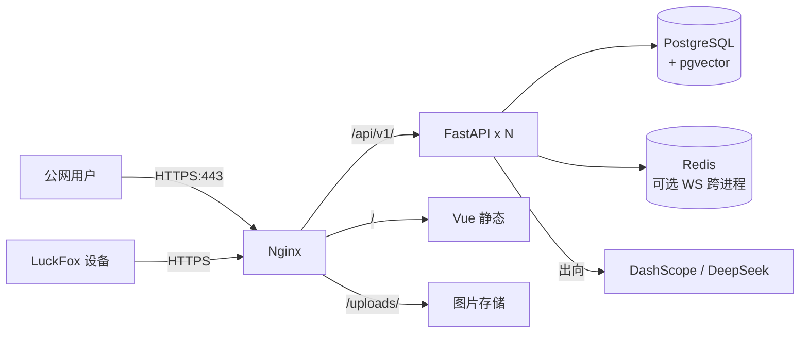

# 系统架构详解

本文档把项目的"端 - 云 - 后 - 前"四层架构、关键数据流、关键设计决策一次说清。

## 总览



## 模块划分

### 后端 `client/`

| 目录 | 职责 |
|---|---|
| `api/admin.py` | 管理员路由（CRUD / 设备 / 配置 / 统计 / 审计） |
| `api/user.py` | 普通用户路由（库存只读 / 对话 / 偏好 / 食谱 / 营养） |
| `api/api.py` | 路由聚合，挂在 `/api/v1` |
| `agents/fridge_agent.py` | ITEM_IN / ITEM_OUT / CHAT 三类 Agent |
| `services/vision.py` | DashScope 多模态识别 |
| `services/embedding.py` | 向量提取 + 阈值定义 |
| `services/dedup.py` | 双层去重统一入口 |
| `services/llm.py` | DeepSeek/Qwen 同步 + 流式 + 教练 + 解释 |
| `services/label_parser.py` | 标签 OCR + 结构化 |
| `services/vision_assist.py` | 共享区间策略决策 |
| `services/ws_manager.py` | 全局 WS 连接池 |
| `services/ws_events.py` | 库存事件广播辅助 |
| `services/auth.py` | 双 JWT + 密码 hash + 鉴权依赖 |
| `services/usage.py` | LLM token 用量记账 |
| `crud/__init__.py` | 数据库读写聚合 |

### 前端 `web/src/`

| 目录 | 职责 |
|---|---|
| `views/admin/*` | 管理员页面（13 个） |
| `views/user/*` | 用户页面（7 个） |
| `components/*` | 跨页面通用组件（CommandPalette / FAB / NotificationBell / EmptyHint / RouteProgressBar / TraceCanvasFlow / RecipeCard / InventoryDetailDrawer / AnimatedNumber） |
| `composables/*` | useInventoryWS / useChartTheme / useUndoToast / useSpeechRecognition |
| `api/admin/*` `api/user/*` | axios 封装，自动带 token |
| `stores/*` | Pinia: adminAuth / userAuth / theme / chat |

## 关键数据流

### 流 1：端侧 ITEM_IN 入库



### 流 2：标签缓冲配对



### 流 3：CHAT 推荐（流式）



### 流 4：WebSocket 全局广播



## 关键设计决策

### 为什么用双 JWT 密钥（admin / user 完全分离）？

`services/auth.py` 用 `ADMIN_JWT_SECRET` / `USER_JWT_SECRET` 两套独立密钥签发 token，token 载荷里嵌入 `user_type='admin'|'user'`，解码时双重校验。

生产环境启动时会拒绝默认 JWT 密钥，并要求配置 `CORS_ORIGINS`；管理员初始化密码通过 `ADMIN_INITIAL_PASSWORD` 显式提供。浏览器端的流式聊天使用 `fetch` stream 携带 `Authorization`，避免把 token 放进 URL。WebSocket 目前仍因浏览器 API 限制使用查询参数传 token，正式部署可进一步升级为一次性短期 WS ticket。

**好处**：
- 即使 user token 泄露也无法访问 admin 路由（密钥不同 + 类型校验）
- 用户名同名（如同样叫 `admin`）也不会混淆
- 数据库表也分 `users` / `admins`，杜绝 SQL 越权

### 为什么去重做两层？

| 层 | 算法 | 复杂度 | 命中场景 |
|---|---|---|---|
| 1 | SHA256 字节哈希 | O(1) | 同一张图重复上传（最常见） |
| 2 | pgvector 余弦相似度 | O(N)（HNSW 索引下近 O(log N)） | 不同角度 / 轻微剪裁的同一物品 |

第一层秒拦，第二层兜底。统一从 `services/dedup.py::check_duplicate` 进入，所有入库路径（手动 / agent / 批量）共用一份逻辑。

### 为什么 Vision 辅助走"区间触发"？

```
端侧 YOLOv5n 置信度
─────────────────────────
< lower (默认 0.3)：太低，端侧大概率瞎猜，跳过云端复核（节省 token）
[lower, upper]：可疑档位，触发云端复核，置信度更高时覆盖
> upper (默认 0.7)：端侧已足够可信，跳过云端
```

由 admin 在前端调，写到 `vision_assist_config` 单行表。所有变更走 `save_log("admin", "VISION_ASSIST_CONFIG_UPDATE", ...)` 留审计。

### 为什么 WebSocket 用 `broadcast_all`？

库存事件本质是"共享 fridge 视图"：admin 删一条食材，所有看 inventory 的 tab 都该立刻更新；user 也该看到。所以不按 user_id 分发，直接 `broadcast_all`，前端自己根据当前页面决定怎么渲染（Inventory 改列表，FridgeMap 改 bbox，大屏滚事件流）。

通知类（临期）才走 `send_to_user(user_id, ...)`，因为通知是私人的。

### 为什么用 pgvector 而不是 Faiss / Pinecone？

- 数据已经在 Postgres，不想再部署一套向量数据库
- 入库 / 查询都在同一事务里，原子性保证
- HNSW 索引性能足够（百万级才会瓶颈）
- pgvector 的 `<=>` 余弦运算符就是 SQL，BI 工具都能直接查

### 为什么 trace 数据写到 `agent_traces` 表而不是 ELK / Jaeger？

- 项目演示场景，运维栈太重
- 数据可直接用 SQL 聚合做性能监控（P50/P95 都是一句 SQL）
- AI 解释直接读这张表喂给 LLM

## 数据库表关系



## 性能指标

| 操作 | P50 | P95 | 备注 |
|---|---|---|---|
| ITEM_IN（含云端 vision + LLM 估算） | ~3-5s | ~8s | 主要是 LLM 推理 |
| 库存查询（带过滤分页） | ~10ms | ~30ms | HNSW 索引保护 |
| 双层去重 | ~50ms | ~200ms | embedding 网络往返 |
| WebSocket 单事件广播 | <5ms | <20ms | 内存 fan-out |
| AI 解释 trace | ~3-6s | ~10s | LLM 推理 |
| 前端首屏（大屏） | ~800ms | ~1.5s | lazy chunk + ECharts 分包 |

> 数据来源：`services/usage.py` 实际记录的 `duration_ms`。

## 部署拓扑



> 单进程部署也能跑（项目目前如此）。多 worker 时 WS 跨进程广播需要 Redis pub/sub。
